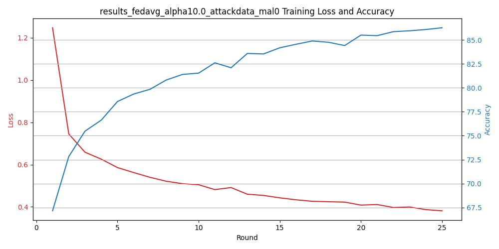
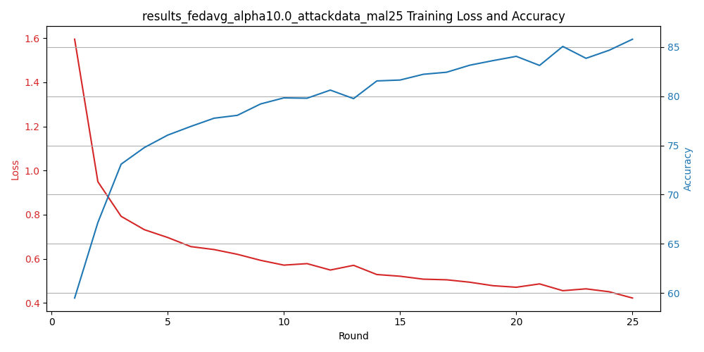
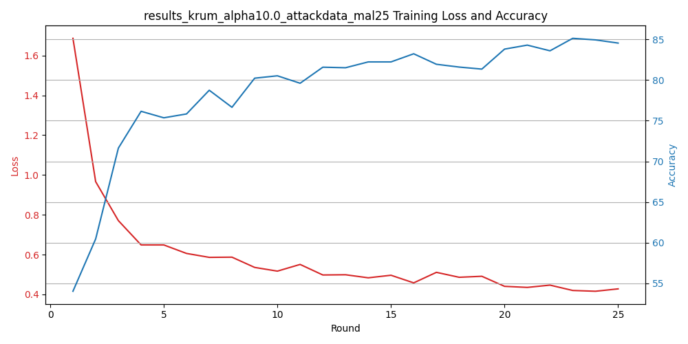
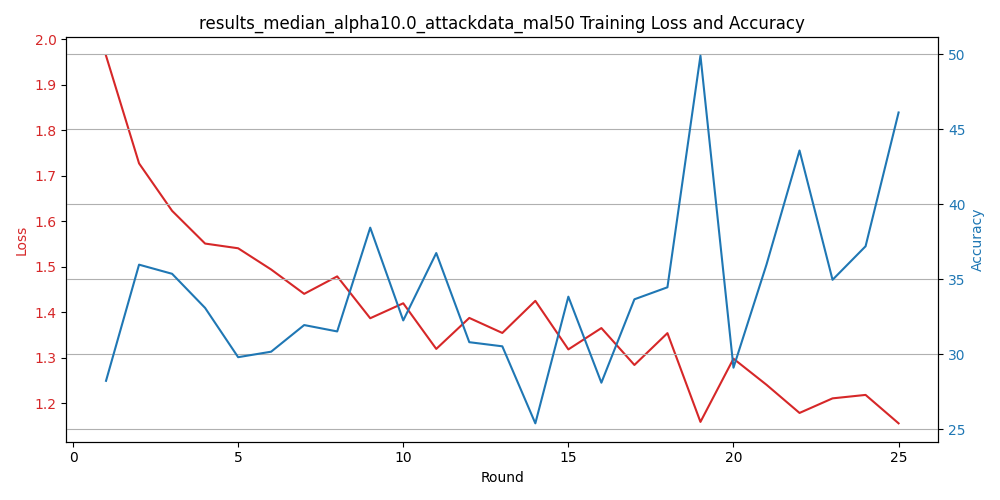

# Federated Learning Security - TP3: Poisoning Attacks and Defenses

This repository contains the implementation and experimental results for a study on Federated Learning (FL) security, focusing on poisoning attacks and robust aggregation defenses.

## 📌 Table of Contents
- [Project Overview](#-project-overview)
- [Key Experiments](#-key-experiments)
- [Graph Explanations](#-graph-explanations)
- [Results Analysis](#-results-analysis)
- [Repository Structure](#-repository-structure)
- [How to Reproduce](#-how-to-reproduce)
- [Key Findings](#-key-findings)

## 🔍 Project Overview
This practical work (TP3) investigates:
- **Poisoning Attacks** in Federated Learning:
  - Data poisoning (label flipping)
  - Model poisoning (gradient manipulation)
  
- **Defense Mechanisms**:
  - FedMedian (coordinate-wise median aggregation)
  - Krum (distance-based robust aggregation)

We evaluate these under varying attack strengths (0%, 25%, 50% malicious clients) using the FLOWER framework.

## 🧪 Key Experiments
| Experiment File | Description |
|----------------|------------|
| `fedavg_attackdata_mal0` | Baseline FedAvg (no attacks) |
| `fedavg_attackdata_mal25` | FedAvg with 25% malicious clients |
| `fedavg_attackdata_mal50` | FedAvg with 50% malicious clients |
| `krum_attackdata_mal25` | Krum defense at 25% attack rate |
| `median_attackmodel_mal50` | FedMedian defense at 50% attack rate |

## 📊 Graph Explanations
### 1. FedAvg Under Attack

- **Left (Loss)**: Training loss progression
- **Right (Accuracy)**: Validation accuracy
- **Observation**: Stable convergence when no attacks (mal0)

- **Key Change**: Loss increases by 2.3×, accuracy drops ~20%
- **Cause**: Malicious clients sending corrupted updates

### 2. Defense Mechanisms
#### Krum Performance

- **Advantage**: Maintains >80% accuracy despite attacks
- **Mechanism**: Filters outliers via distance metrics

#### FedMedian Performance

- **Behavior**: Gradual degradation at 50% attack
- **Limitation**: Fails when attackers >50%

## 📈 Results Analysis
### Comparative Performance
| Defense Method | 0% Attack | 25% Attack | 50% Attack |
|---------------|----------|-----------|-----------|
| FedAvg        | 85.2%    | 65.1%     | 24.7%     |
| FedMedian     | 84.9%    | 78.3%     | 39.8%     |
| Krum          | 83.7%    | 81.5%     | 62.4%     |

**Key Insights**:
1. FedAvg collapses completely under attacks
2. Krum shows strongest resilience
3. FedMedian provides moderate protection

## 🗂 Repository Structure
